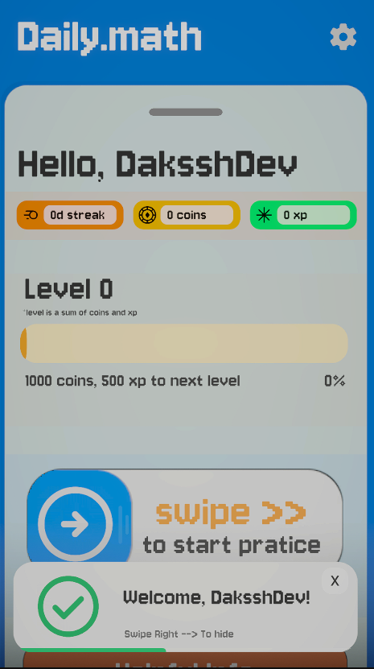
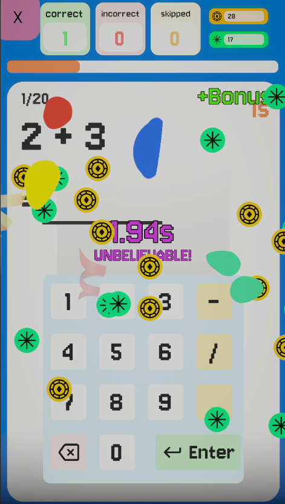
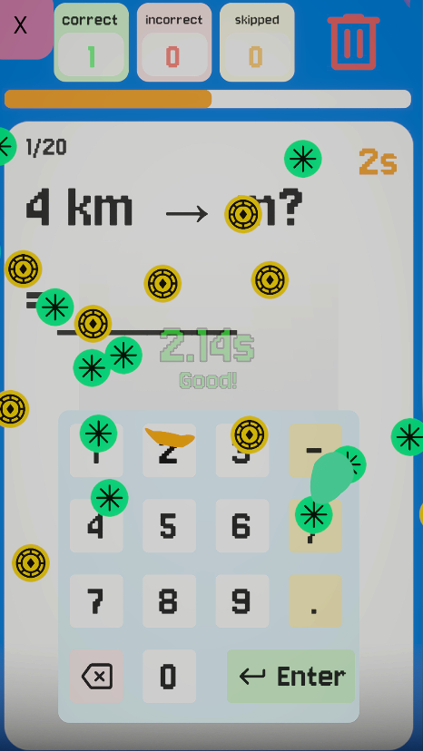
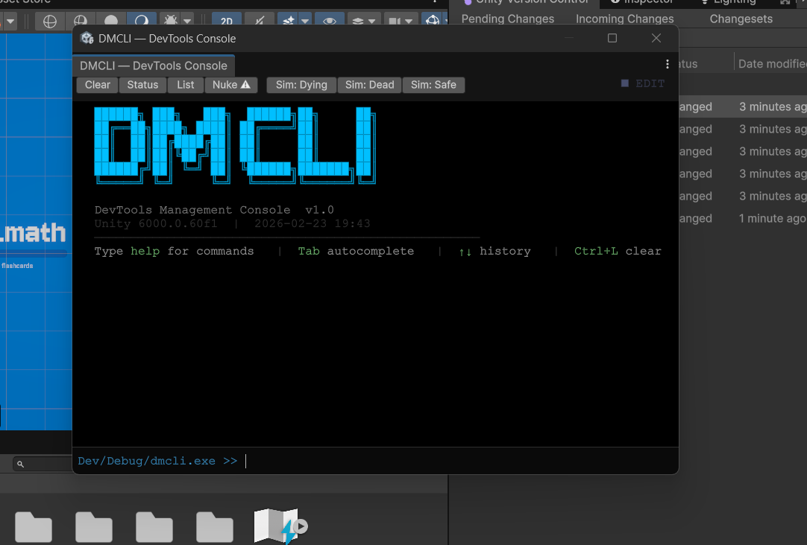

# Daily.math

A casual mental math practice game 😎 built with Unity. (for Android ONLY) Practice daily, maintain streaks, and improve your mental math skills with smooth animations and a clean and minimalist interface.

## Features

- Daily math challenges for daily practice
- Streak system to track your consistency
- Practice mode for casual play
- Smooth animations and polished UI
- Completely offline - no internet required

## Downloads

Downloads are available in the [Releases](https://github.com/DaksshDev/Daily.math/releases) page! 
**Only available as .apk for android no Windows/IOS/Linux support planned (yet).

## Screenshots

<div align="center">
  
  
  
</div>

<div align="center">
  
  <p><i>Custom editor window to debug the game</i></p>
</div>


## Getting Started With The Code

### Requirements

- Unity 2021.3 or newer
- Android Build Support and Android build tools installed

### Setup

1. Clone the repo
```bash
git clone https://github.com/DaksshDev/Daily.math.git
```

2. Click open button in Unity Hub

3. Select the cloned repo and click ok.

4. Open the unity project.

## How It Works

The game gives you math problems daily. Solve them, maintain your streak, and watch yourself get better at mental math. Simple as that.

There's also a practice mode if you just want to improve specific areas of knowledge like **tables, squares, cubes and conversion charts**.

## Tech Stack

Built with Unity and C# (Uses some free assets that can be found on the [Unity Asset Store](https://assetstore.unity.com))

## Contributing

Found a bug or want to add something? Feel free to open an issue or submit a pull request. (**Please create an issue before submitting a PR**)

## Project Structure
```
Daily.math/
├── Assets/           # All game assets, scripts, scenes
├── Packages/         # Unity packages
└── ProjectSettings/  # Unity configuration
```

---
If you like this project, please star ⭐ it! It helps a lot, Thanks!
Made with Unity. No data collection, no ads, just improve your mental math skills!.